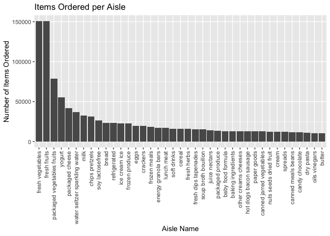
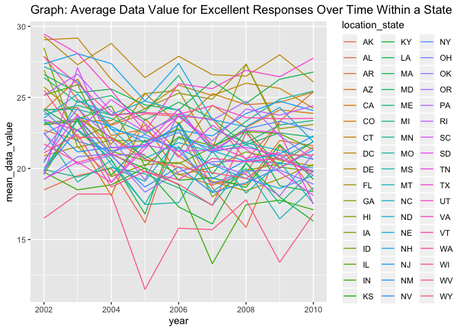
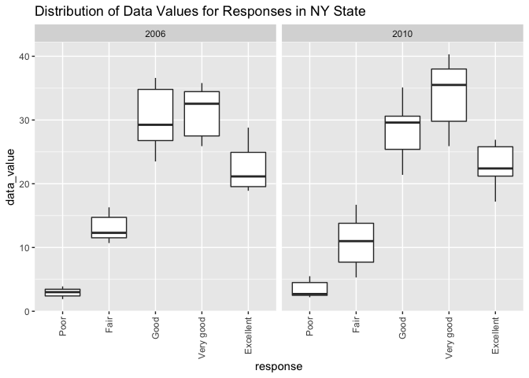

p8105\_hw3\_niz2000
================
Nora Zakaria
10/14/2019

This first step loads the tidyverse into the markdown
    document.

``` r
library(tidyverse)
```

    ## ── Attaching packages ─────────────────────────────────────── tidyverse 1.2.1 ──

    ## ✔ ggplot2 3.2.1     ✔ purrr   0.3.2
    ## ✔ tibble  2.1.3     ✔ dplyr   0.8.3
    ## ✔ tidyr   1.0.0     ✔ stringr 1.4.0
    ## ✔ readr   1.3.1     ✔ forcats 0.4.0

    ## ── Conflicts ────────────────────────────────────────── tidyverse_conflicts() ──
    ## ✖ dplyr::filter() masks stats::filter()
    ## ✖ dplyr::lag()    masks stats::lag()

# Problem 1

## Load the Instacart Dataset

``` r
library(p8105.datasets)
data("instacart")
instacart
```

    ## # A tibble: 1,384,617 x 15
    ##    order_id product_id add_to_cart_ord… reordered user_id eval_set
    ##       <int>      <int>            <int>     <int>   <int> <chr>   
    ##  1        1      49302                1         1  112108 train   
    ##  2        1      11109                2         1  112108 train   
    ##  3        1      10246                3         0  112108 train   
    ##  4        1      49683                4         0  112108 train   
    ##  5        1      43633                5         1  112108 train   
    ##  6        1      13176                6         0  112108 train   
    ##  7        1      47209                7         0  112108 train   
    ##  8        1      22035                8         1  112108 train   
    ##  9       36      39612                1         0   79431 train   
    ## 10       36      19660                2         1   79431 train   
    ## # … with 1,384,607 more rows, and 9 more variables: order_number <int>,
    ## #   order_dow <int>, order_hour_of_day <int>,
    ## #   days_since_prior_order <int>, product_name <chr>, aisle_id <int>,
    ## #   department_id <int>, aisle <chr>, department <chr>

The Instacart dataset was loaded, and consists of 1,384,617 observations
and 17 variables relating to instacart products and orders. Key
variables include the order\_id, product\_id, reordered,
days\_since\_prior\_order, product\_name, and the department. Using the
dataset, you can determine information about specific ordering behavior
for an individual. For example, order identifier 1 (order\_id) ordered
product number 49302 (product\_id=49302) Bulgarian Yogurt
(product\_name) from the dairy eggs department (department), and
reordered the product an additional time (reordered). Order identifier
36 (order\_id) ordered water seltzer sparkling water (product\_name)
from the beverages department (department), 7 days after their last
instacart order
(days\_since\_prior\_order).

## How many aisles there are, and which aisles the most items are ordered from?

``` r
instacart %>%
  count(aisle)  %>%
  arrange(desc(n)) 
```

    ## # A tibble: 134 x 2
    ##    aisle                              n
    ##    <chr>                          <int>
    ##  1 fresh vegetables              150609
    ##  2 fresh fruits                  150473
    ##  3 packaged vegetables fruits     78493
    ##  4 yogurt                         55240
    ##  5 packaged cheese                41699
    ##  6 water seltzer sparkling water  36617
    ##  7 milk                           32644
    ##  8 chips pretzels                 31269
    ##  9 soy lactosefree                26240
    ## 10 bread                          23635
    ## # … with 124 more rows

The most items ordered were from the fresh vegetables and fresh fruits
aisles, at 150,609 items and 150,473 items, respectively. The aisle with
the next highest items ordered was the packaged vegetables fruits aisle,
at 78,493
items.

## Plot demonstrating the number of items ordered in each aisle, limited to aisles with more than 10000 items ordered

``` r
Aisle_items_plot = instacart %>%
  count(aisle) %>%
  filter(n > 10000) %>%
  arrange(desc(n)) %>%
  rename(n_items_ordered = n)

Aisle_items_plot %>%
  ggplot(aes(x = reorder(aisle, -n_items_ordered), y = n_items_ordered)) +
  geom_bar(stat = "identity") +
  theme(axis.text.x = element_text(angle = 90, hjust = 1, vjust = 0.5)) +
  labs(
    title = "Items Ordered per Aisle",
    x = "Aisle Name",
    y = "Number of Items Ordered")
```

<!-- -->

## 3 most popular items in each of the aisles “baking ingredients”, “dog food care”, and “packaged vegetables fruits”

``` r
instacart %>%
  group_by(product_name, aisle) %>%
  summarize(
    n_items_ordered = n()
    ) %>%
  group_by(aisle) %>%
  filter(
    aisle %in% c("baking ingredients", "dog food care", "packaged vegetables fruits"),
    min_rank(desc(n_items_ordered)) <4 ) %>%
  arrange(n_items_ordered, aisle) %>%
  knitr::kable(format = 'pandoc' , caption = "Table: Most Popular Items by Aisle")
```

| product\_name                                 | aisle                      | n\_items\_ordered |
| :-------------------------------------------- | :------------------------- | ----------------: |
| Small Dog Biscuits                            | dog food care              |                26 |
| Organix Chicken & Brown Rice Recipe           | dog food care              |                28 |
| Snack Sticks Chicken & Rice Recipe Dog Treats | dog food care              |                30 |
| Cane Sugar                                    | baking ingredients         |               336 |
| Pure Baking Soda                              | baking ingredients         |               387 |
| Light Brown Sugar                             | baking ingredients         |               499 |
| Organic Blueberries                           | packaged vegetables fruits |              4966 |
| Organic Raspberries                           | packaged vegetables fruits |              5546 |
| Organic Baby Spinach                          | packaged vegetables fruits |              9784 |

Table: Most Popular Items by
Aisle

## Mean hour of the day at which Pink Lady Apples and Coffee Ice Cream are ordered on each day of the week

``` r
instacart %>%
  select(product_name, order_dow, order_hour_of_day) %>% 
  filter(
    product_name %in% c("Pink Lady Apples", "Coffee Ice Cream")) %>%
  group_by(product_name, order_dow) %>%
  summarise(mean_hour = mean(order_hour_of_day)) %>%
  mutate(
    day_of_week = recode(order_dow,
      `0` = "Sunday",
      `1` = "Monday",
      `2` = "Tuesday",
      `3` = "Wednesday",
      `4` = "Thursday",
      `5` = "Friday",
      `6` = "Saturday")) %>%
  select(product_name, day_of_week, mean_hour) %>% 
  pivot_wider(
    names_from = "day_of_week",
    values_from = "mean_hour") %>% 
  knitr::kable(format= 'pandoc', caption = "Table: Mean Hour Pink Lady Apples and Coffee Ice Cream are Ordered")
```

| product\_name    |   Sunday |   Monday |  Tuesday | Wednesday | Thursday |   Friday | Saturday |
| :--------------- | -------: | -------: | -------: | --------: | -------: | -------: | -------: |
| Coffee Ice Cream | 13.77419 | 14.31579 | 15.38095 |  15.31818 | 15.21739 | 12.26316 | 13.83333 |
| Pink Lady Apples | 13.44118 | 11.36000 | 11.70213 |  14.25000 | 11.55172 | 12.78431 | 11.93750 |

Table: Mean Hour Pink Lady Apples and Coffee Ice Cream are Ordered

# Problem 2

## Load BRFSS Dataset

``` r
library(p8105.datasets)
data("brfss_smart2010")
```

## Clean the BRFSS Dataset

``` r
brfss = brfss_smart2010 %>%
  janitor::clean_names() %>%
  filter(topic == "Overall Health") %>%
  select(-data_value_footnote_symbol, -data_value_footnote, -location_id) %>%
  drop_na(response) %>%
  mutate(response = as.factor(response),
         response = factor(response,
                           levels = c("Poor", "Fair", "Good", "Very good", "Excellent"))) %>%
  rename(
    location_state= locationabbr,
    location_county= locationdesc)
brfss
```

    ## # A tibble: 10,625 x 20
    ##     year location_state location_county class topic question response
    ##    <int> <chr>          <chr>           <chr> <chr> <chr>    <fct>   
    ##  1  2010 AL             AL - Jefferson… Heal… Over… How is … Excelle…
    ##  2  2010 AL             AL - Jefferson… Heal… Over… How is … Very go…
    ##  3  2010 AL             AL - Jefferson… Heal… Over… How is … Good    
    ##  4  2010 AL             AL - Jefferson… Heal… Over… How is … Fair    
    ##  5  2010 AL             AL - Jefferson… Heal… Over… How is … Poor    
    ##  6  2010 AL             AL - Mobile Co… Heal… Over… How is … Excelle…
    ##  7  2010 AL             AL - Mobile Co… Heal… Over… How is … Very go…
    ##  8  2010 AL             AL - Mobile Co… Heal… Over… How is … Good    
    ##  9  2010 AL             AL - Mobile Co… Heal… Over… How is … Fair    
    ## 10  2010 AL             AL - Mobile Co… Heal… Over… How is … Poor    
    ## # … with 10,615 more rows, and 13 more variables: sample_size <int>,
    ## #   data_value <dbl>, confidence_limit_low <dbl>,
    ## #   confidence_limit_high <dbl>, display_order <int>,
    ## #   data_value_unit <chr>, data_value_type <chr>, data_source <chr>,
    ## #   class_id <chr>, topic_id <chr>, question_id <chr>, respid <chr>,
    ## #   geo_location <chr>

BRFSS is a continuous, state-based surveillance system that collects
information about modifiable risk factors for chronic diseases and other
leading causes of
death.

## In 2002, which states were observed at 7 or more locations? What about in 2010?

``` r
# Restricting to 2002
location_2002 = brfss %>%
  filter(year == "2002") %>%
  distinct(location_state, location_county) %>%
  count(location_state) %>%
  filter(n >= 7) %>%
  rename(number_sites = n)
location_2002 
```

    ## # A tibble: 6 x 2
    ##   location_state number_sites
    ##   <chr>                 <int>
    ## 1 CT                        7
    ## 2 FL                        7
    ## 3 MA                        8
    ## 4 NC                        7
    ## 5 NJ                        8
    ## 6 PA                       10

``` r
# Restricting to 2010
location_2010 = brfss %>%
  filter(year == "2010") %>%
  distinct(location_state, location_county) %>%
  count(location_state) %>%
  filter(n >= 7) %>%
  rename(number_sites = n)
location_2010
```

    ## # A tibble: 14 x 2
    ##    location_state number_sites
    ##    <chr>                 <int>
    ##  1 CA                       12
    ##  2 CO                        7
    ##  3 FL                       41
    ##  4 MA                        9
    ##  5 MD                       12
    ##  6 NC                       12
    ##  7 NE                       10
    ##  8 NJ                       19
    ##  9 NY                        9
    ## 10 OH                        8
    ## 11 PA                        7
    ## 12 SC                        7
    ## 13 TX                       16
    ## 14 WA                       10

## Construct a dataset that is limited to Excellent responses, and contains, year, state, and a variable that averages the data\_value across locations within a state. Make a “spaghetti” plot of this average value over time within a state (that is, make a plot showing a line for each state across years – the geom\_line geometry and group aesthetic will help)

``` r
excellent_responses = brfss %>%
  filter(response == "Excellent") %>%
  group_by(year, location_state) %>%
  summarise(
    mean_data_value = mean(data_value)) %>%
  ggplot(aes(x = year, y = mean_data_value, group = location_state, color = location_state)) +
    geom_line()+
    labs(title = "Average Data Value for Excellent Responses Over Time Within a State")
excellent_responses
```

    ## Warning: Removed 3 rows containing missing values (geom_path).

<!-- -->

## Make a two-panel plot showing, for the years 2006, and 2010, distribution of data\_value for responses (“Poor” to “Excellent”) among locations in NY State

``` r
responses_2006_2010 = brfss %>%
  filter(location_state == "NY",
        year %in% c("2006", "2010")) %>%
  select(year, response, data_value) %>%
  ggplot(aes(x = response, y = data_value)) +
    geom_boxplot() +
    facet_grid(~year) +
    theme(axis.text.x = element_text(angle = 90, hjust = 1, vjust = 0.5)) +
    labs(title = "Distribution of Data Values for Responses in NY State")
responses_2006_2010
```

<!-- -->

# Problem 3
