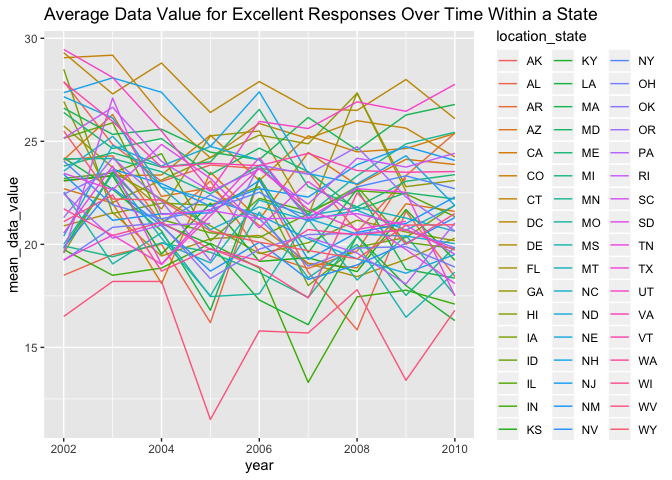

p8105\_hw3\_niz2000
================
Nora Zakaria
10/14/2019

The first step of the assignment is to load tidyverse into the markdown
document.

``` r
library(tidyverse)
```

    ## ── Attaching packages ────────────────────────────────────────────── tidyverse 1.2.1 ──

    ## ✔ ggplot2 3.2.1     ✔ purrr   0.3.2
    ## ✔ tibble  2.1.3     ✔ dplyr   0.8.3
    ## ✔ tidyr   1.0.0     ✔ stringr 1.4.0
    ## ✔ readr   1.3.1     ✔ forcats 0.4.0

    ## ── Conflicts ───────────────────────────────────────────────── tidyverse_conflicts() ──
    ## ✖ dplyr::filter() masks stats::filter()
    ## ✖ dplyr::lag()    masks stats::lag()

# Problem 1

Problem 1 uses the Instacart Online Grocery Shopping Dataset from 2017,
loaded from the course datasets, and not from my local data directory
for the p8105\_hw3\_niz20000 project.

## Load the Instacart Dataset

The first step for problem 1 is to load the instacart dataset.

``` r
library(p8105.datasets)
data("instacart")
instacart
```

    ## # A tibble: 1,384,617 x 15
    ##    order_id product_id add_to_cart_ord… reordered user_id eval_set
    ##       <int>      <int>            <int>     <int>   <int> <chr>   
    ##  1        1      49302                1         1  112108 train   
    ##  2        1      11109                2         1  112108 train   
    ##  3        1      10246                3         0  112108 train   
    ##  4        1      49683                4         0  112108 train   
    ##  5        1      43633                5         1  112108 train   
    ##  6        1      13176                6         0  112108 train   
    ##  7        1      47209                7         0  112108 train   
    ##  8        1      22035                8         1  112108 train   
    ##  9       36      39612                1         0   79431 train   
    ## 10       36      19660                2         1   79431 train   
    ## # … with 1,384,607 more rows, and 9 more variables: order_number <int>,
    ## #   order_dow <int>, order_hour_of_day <int>,
    ## #   days_since_prior_order <int>, product_name <chr>, aisle_id <int>,
    ## #   department_id <int>, aisle <chr>, department <chr>

The Instacart dataset was loaded, and consists of 1384617 observations
and 15 variables from 131,209 unique users, where each observation, or
row, in the dataset represents a product from an order. Key variables
that are used to interpret observations in the data and that are
relevant to future analyses in this problem include the “order\_id,”
“product\_id,” “reordered,” “days\_since\_prior\_order,”
“product\_name,” “aisle,” and the “department” variables. Using the
dataset and these key variables, information about specific ordering
behavior for an individual can be determined. For example, order
identifier 1 (order\_id) ordered product number 49302 (product\_id), or
Bulgarian Yogurt (product\_name), from the dairy eggs department
(department), and reordered the product one additional time (reordered).
Order identifier 36 (order\_id) ordered water seltzer sparkling water
(product\_name) from the beverages department (department), 7 days after
their last instacart order was placed (days\_since\_prior\_order).

## Instacart Aisles and Where the Most Items are Ordered From

This next step answers the question how many aisles there are in the
instacart data, as well as which aisles the most items are ordered from.
This involved finding the total number of items ordered per aisle, and
ordering the aisles by descending, where the aisle with the most items
ordered is at the top and the aisle with the least items ordered is at
the bottom.

``` r
aisles = instacart %>%
  count(aisle)  %>%
  arrange(desc(n)) 
aisles
```

    ## # A tibble: 134 x 2
    ##    aisle                              n
    ##    <chr>                          <int>
    ##  1 fresh vegetables              150609
    ##  2 fresh fruits                  150473
    ##  3 packaged vegetables fruits     78493
    ##  4 yogurt                         55240
    ##  5 packaged cheese                41699
    ##  6 water seltzer sparkling water  36617
    ##  7 milk                           32644
    ##  8 chips pretzels                 31269
    ##  9 soy lactosefree                26240
    ## 10 bread                          23635
    ## # … with 124 more rows

There are 134 aisles in the instacart dataset. The most items ordered
were from the fresh vegetables aisle at 150,609 items, followed by the
fresh fruits aisles at 150,473 items. The aisle with the next highest
number of items ordered was the packaged vegetables fruits aisle, at
78,493 items.

## Plot of the Number of Items Ordered Per Aisle

In this next step, I created a plot to demonstrate the number of items
ordered in each aisle, limited to aisles that had more than 10,000 items
ordered. To do so, I filtered the “n” variable representing the total
number of items ordered per aisle to only include aisles that had more
than 10,000 items ordered. To arrange aisles sensibly in the plot, I
reordered the aisles so that the plot would display aisles from greatest
to least items ordered, from left to right. To increase readability, I
formatted the aisle names vertically under each bar in the bar graph,
and added labels for the graph and axes.

``` r
Aisle_items_plot = instacart %>%
  count(aisle) %>%
  filter(n > 10000) %>%
  arrange(desc(n)) %>%
  rename(n_items_ordered = n) %>%
  ggplot(aes(x = reorder(aisle, -n_items_ordered), y = n_items_ordered)) +
  geom_bar(stat = "identity") +
  theme(axis.text.x = element_text(angle = 90, hjust = 1, vjust = 0.5)) +
  labs(
    title = "Items Ordered per Aisle",
    x = "Aisle Name",
    y = "Number of Items Ordered")
Aisle_items_plot
```

<!-- -->

## Table Demonstrating Popular Items in 3 Different Aisles

This next step creates a table displaying the three most popular items
in each of the aisles “baking ingredients”, “dog food care”, and
“packaged vegetables fruits,” and the number of times that each item
was ordered. The three aisle names are displayed in the leftmost column,
and the product names and the number of times they were ordered are
displayed in the middle and rightmost columns, ordered by the 3rd most
popular item at the top to the most popular item at the bottom, within
each of the three aisles.

``` r
instacart %>%
  group_by(aisle, product_name) %>%
  summarize(
    n_items_ordered = n()
    ) %>%
  group_by(aisle) %>%
  filter(
    aisle %in% c("baking ingredients", "dog food care", "packaged vegetables fruits"),
    min_rank(desc(n_items_ordered)) <4 ) %>%
  arrange(n_items_ordered, aisle) %>%
  knitr::kable(format = 'pandoc' , caption = "Table: Most Popular Items by Aisle")
```

| aisle                      | product\_name                                 | n\_items\_ordered |
| :------------------------- | :-------------------------------------------- | ----------------: |
| dog food care              | Small Dog Biscuits                            |                26 |
| dog food care              | Organix Chicken & Brown Rice Recipe           |                28 |
| dog food care              | Snack Sticks Chicken & Rice Recipe Dog Treats |                30 |
| baking ingredients         | Cane Sugar                                    |               336 |
| baking ingredients         | Pure Baking Soda                              |               387 |
| baking ingredients         | Light Brown Sugar                             |               499 |
| packaged vegetables fruits | Organic Blueberries                           |              4966 |
| packaged vegetables fruits | Organic Raspberries                           |              5546 |
| packaged vegetables fruits | Organic Baby Spinach                          |              9784 |

Table: Most Popular Items by Aisle

  - The three most popular products in the “dog food care” aisle were
    small dog biscuits, organix chicken and brown rice recipe, and snack
    sticks chicken and rice recipe dog treats, ordered 26, 28, and 30
    times respectively.
  - The three most popular products in the “baking ingredients” aisle
    were cane sugar, pure baking soda, and light brown sugar, ordered
    336, 387, and 499 times respectively.
  - The three most popular products in the “packaged vegetables fruits”
    aisle were organic blueberries, organic raspberries, and organic
    baby spinach, ordered 4,966, 5,546, and 9,784 times respectively.

## Pink Lady Apples and Coffee Ice Cream

This step displays a table of the mean hour of the day at which the Pink
Lady Apples and Coffee Ice Cream products are ordered on each day of the
week. The final table displays the two products of consideration, seven
columns for the seven days of the week, and the mean hour of the day at
which each product is ordered displayed under the corresponding day of
the week.

``` r
instacart %>%
  select(product_name, order_dow, order_hour_of_day) %>% 
  filter(
    product_name %in% c("Pink Lady Apples", "Coffee Ice Cream")) %>%
  group_by(product_name, order_dow) %>%
  summarise(mean_hour = mean(order_hour_of_day)) %>%
  mutate(
    day_of_week = recode(order_dow,
      `0` = "Sunday",
      `1` = "Monday",
      `2` = "Tuesday",
      `3` = "Wednesday",
      `4` = "Thursday",
      `5` = "Friday",
      `6` = "Saturday")) %>%
  select(product_name, day_of_week, mean_hour) %>% 
  pivot_wider(
    names_from = "day_of_week",
    values_from = "mean_hour") %>% 
  knitr::kable(format= 'pandoc', caption = "Table: Mean Hour Pink Lady Apples and Coffee Ice Cream are Ordered")
```

| product\_name    |   Sunday |   Monday |  Tuesday | Wednesday | Thursday |   Friday | Saturday |
| :--------------- | -------: | -------: | -------: | --------: | -------: | -------: | -------: |
| Coffee Ice Cream | 13.77419 | 14.31579 | 15.38095 |  15.31818 | 15.21739 | 12.26316 | 13.83333 |
| Pink Lady Apples | 13.44118 | 11.36000 | 11.70213 |  14.25000 | 11.55172 | 12.78431 | 11.93750 |

Table: Mean Hour Pink Lady Apples and Coffee Ice Cream are Ordered

On Sunday and Friday, Coffee Ice Cream and Pink Lady Apples were both
ordered around 12-1pm on average. For the remaining days of the week,
Pink Lady Apples were ordered at an earlier in the day on average,
compared to Coffee Ice Cream.

# Problem 2

Problem 2 uses BRFSS data, loaded from the course datasets, and not from
my local data directory for the p8105\_hw3\_niz20000 project. BRFSS is a
continuous, state-based surveillance system that collects information
about modifiable risk factors for chronic diseases and other leading
causes of death.

## Load BRFSS Dataset

The first step for problem 2 is to load the BRFSS dataset.

``` r
library(p8105.datasets)
data("brfss_smart2010")
```

## Clean the BRFSS Dataset

In order to perform analyses, the BRFSS data needs to be cleaned. The
data was formatted using appropriate variable names, such as renaming
the locationabbr and locationdesc variables to more clearly designate
which variable corresponds to a US state, and which to a county within
that state, using the names “location\_state” and “location\_county.” In
order to focus on the Overall Health topic, the topic variable was
filtered. The response variable was converted to a factor variable, with
levels ordered from “Poor” to “Excellent,” and any responses that did
not fall within those bounds were dropped.

``` r
brfss = brfss_smart2010 %>%
  janitor::clean_names() %>%
  filter(topic == "Overall Health") %>%
  select(-data_value_footnote_symbol, -data_value_footnote, -location_id) %>%
  drop_na(response) %>%
  mutate(response = as.factor(response),
         response = factor(response,
                           levels = c("Poor", "Fair", "Good", "Very good", "Excellent"))) %>%
  rename(
    location_state= locationabbr,
    location_county= locationdesc)
brfss
```

    ## # A tibble: 10,625 x 20
    ##     year location_state location_county class topic question response
    ##    <int> <chr>          <chr>           <chr> <chr> <chr>    <fct>   
    ##  1  2010 AL             AL - Jefferson… Heal… Over… How is … Excelle…
    ##  2  2010 AL             AL - Jefferson… Heal… Over… How is … Very go…
    ##  3  2010 AL             AL - Jefferson… Heal… Over… How is … Good    
    ##  4  2010 AL             AL - Jefferson… Heal… Over… How is … Fair    
    ##  5  2010 AL             AL - Jefferson… Heal… Over… How is … Poor    
    ##  6  2010 AL             AL - Mobile Co… Heal… Over… How is … Excelle…
    ##  7  2010 AL             AL - Mobile Co… Heal… Over… How is … Very go…
    ##  8  2010 AL             AL - Mobile Co… Heal… Over… How is … Good    
    ##  9  2010 AL             AL - Mobile Co… Heal… Over… How is … Fair    
    ## 10  2010 AL             AL - Mobile Co… Heal… Over… How is … Poor    
    ## # … with 10,615 more rows, and 13 more variables: sample_size <int>,
    ## #   data_value <dbl>, confidence_limit_low <dbl>,
    ## #   confidence_limit_high <dbl>, display_order <int>,
    ## #   data_value_unit <chr>, data_value_type <chr>, data_source <chr>,
    ## #   class_id <chr>, topic_id <chr>, question_id <chr>, respid <chr>,
    ## #   geo_location <chr>

The BRFSS dataset was loaded, and consists of 10625 observations and 20
variables.

## States Observed at 7 or More Locations

In this step, the BRFSS data was used to determine which states were
observed at at least 7 county locations, in the years 2002 and 2010. The
first section of code corresponds to 2002 while the second code
corresponds to 2010, through filtering the year variable accordingly.

``` r
# Restricting to 2002
location_2002 = brfss %>%
  filter(year == "2002") %>%
  distinct(location_state, location_county) %>%
  count(location_state) %>%
  filter(n >= 7) %>%
  rename(number_sites = n)
location_2002 
```

    ## # A tibble: 6 x 2
    ##   location_state number_sites
    ##   <chr>                 <int>
    ## 1 CT                        7
    ## 2 FL                        7
    ## 3 MA                        8
    ## 4 NC                        7
    ## 5 NJ                        8
    ## 6 PA                       10

``` r
# Restricting to 2010
location_2010 = brfss %>%
  filter(year == "2010") %>%
  distinct(location_state, location_county) %>%
  count(location_state) %>%
  filter(n >= 7) %>%
  rename(number_sites = n)
location_2010
```

    ## # A tibble: 14 x 2
    ##    location_state number_sites
    ##    <chr>                 <int>
    ##  1 CA                       12
    ##  2 CO                        7
    ##  3 FL                       41
    ##  4 MA                        9
    ##  5 MD                       12
    ##  6 NC                       12
    ##  7 NE                       10
    ##  8 NJ                       19
    ##  9 NY                        9
    ## 10 OH                        8
    ## 11 PA                        7
    ## 12 SC                        7
    ## 13 TX                       16
    ## 14 WA                       10

There were 6 states that were observed at at least 7 county locations in
2002, and 14 states that were observed at at least 7 county locations in
2010.

## Spaghetti Plot of Average Data Value for Excellent Responses Across Locations by State

In this step, a new dataset called “excellent\_responses” limited to
“Excellent” responses was constructed, containing, year, state, and a
new variable that averages the data\_value across locations within a
state, called “mean\_data\_value.” After contructing the dataset, a
“spaghetti” plot of mean\_data\_value over the years of the study was
generated.

``` r
excellent_responses = brfss %>%
  filter(response == "Excellent") %>%
  group_by(year, location_state) %>%
  summarise(
    mean_data_value = mean(data_value)) %>%
  ggplot(aes(x = year, y = mean_data_value, group = location_state, color = location_state)) +
    geom_line()+
    labs(title = "Average Data Value for Excellent Responses Over Time Within a State")
excellent_responses
```

    ## Warning: Removed 3 rows containing missing values (geom_path).

<!-- -->

The plot displays one line for each US state, demonstrating the change
in the mean data value over time, in years. Each US state corresponds
with a color.

## Two-Panel Plot of Data Value for Responses in NY

In this step a two-panel plot is displayed for the years 2006 and 2010.
In each panel, the distribution of the variable data\_value for each
response level (“Poor” to “Excellent”) is displayed as a boxplot,
restricting the location\_state of both panels to NY.

``` r
responses_2006_2010 = brfss %>%
  filter(location_state == "NY",
        year %in% c("2006", "2010")) %>%
  select(year, response, data_value) %>%
  ggplot(aes(x = response, y = data_value)) +
    geom_boxplot() +
    facet_grid(~year) +
    theme(axis.text.x = element_text(angle = 90, hjust = 1, vjust = 0.5)) +
    labs(title = "Distribution of Data Values for Responses in NY State")
responses_2006_2010
```

<!-- -->

The two-panel plot displays the 2006 data on the left, and 2010 data on
the right. While the data values are distributed fairly consistently by
response level between the two years, the “Good” and “Very good”
response levels differ slighlty from 2006 to 2010. In 2010, the “Good”
response level has a lower data value distribution and the “Very good”
response level has a higher data value distribution, compared to 2006.

# Problem 3

Problem 3 uses accelerometer data, loaded from the accel\_data CSV file
found in my local data directory “Data” in the p8105\_hw3\_niz20000
project. Accelerometers are devices that measure activity counts in a
short period; in this case one-minute intervals. Because accelerometers
can be worn comfortably and unobtrusively, they produce around-the-clock
observations.

## Load and Tidy the Accelerometer Data

The first step for problem 3 is to load the accel\_data dataset. In
order to load, tidy, and wrangle the dataset, all originally observed
variables and values were preserved. However to ensure useful variable
names, the day\_id variable corresponding to the 35 days of observation
was renamed to “day\_number,” with values ranging from 1 to 35, and the
day variable corresponding to the day of the week was renamed to
“day\_of\_the\_week.” An additional variable called “day\_type” was
created to demonstrate whether or not the day\_of\_the\_week corresponds
with the weekend or a weekday. Another consideration in data cleaning is
that the data has reasonable variable classes. The day of the week and
day type variables are character, with the remaining week, day number,
and activity variables “double” variables, which are resonable as R
automatically converts between dbl and integer variables.

``` r
accelerometer = 
  read_csv(file = "./data/accel_data.csv") %>%
  janitor::clean_names() %>%
  mutate(
    day_type = if_else(day %in% c("Monday", "Tuesday", "Wednesday", "Thursday", "Friday"), "Weekday", day),
    day_type = if_else(day %in% c("Saturday", "Sunday"), "Weekend", day_type)) %>%
  rename(
    day_number = day_id,
    day_of_the_week= day) %>%
  select(week, day_number, day_of_the_week, day_type, activity_1:activity_1440)
```

    ## Parsed with column specification:
    ## cols(
    ##   .default = col_double(),
    ##   day = col_character()
    ## )

    ## See spec(...) for full column specifications.

``` r
accelerometer
```

    ## # A tibble: 35 x 1,444
    ##     week day_number day_of_the_week day_type activity_1 activity_2
    ##    <dbl>      <dbl> <chr>           <chr>         <dbl>      <dbl>
    ##  1     1          1 Friday          Weekday        88.4       82.2
    ##  2     1          2 Monday          Weekday         1          1  
    ##  3     1          3 Saturday        Weekend         1          1  
    ##  4     1          4 Sunday          Weekend         1          1  
    ##  5     1          5 Thursday        Weekday        47.4       48.8
    ##  6     1          6 Tuesday         Weekday        64.8       59.5
    ##  7     1          7 Wednesday       Weekday        71.1      103. 
    ##  8     2          8 Friday          Weekday       675        542  
    ##  9     2          9 Monday          Weekday       291        335  
    ## 10     2         10 Saturday        Weekend        64         11  
    ## # … with 25 more rows, and 1,438 more variables: activity_3 <dbl>,
    ## #   activity_4 <dbl>, activity_5 <dbl>, activity_6 <dbl>,
    ## #   activity_7 <dbl>, activity_8 <dbl>, activity_9 <dbl>,
    ## #   activity_10 <dbl>, activity_11 <dbl>, activity_12 <dbl>,
    ## #   activity_13 <dbl>, activity_14 <dbl>, activity_15 <dbl>,
    ## #   activity_16 <dbl>, activity_17 <dbl>, activity_18 <dbl>,
    ## #   activity_19 <dbl>, activity_20 <dbl>, activity_21 <dbl>,
    ## #   activity_22 <dbl>, activity_23 <dbl>, activity_24 <dbl>,
    ## #   activity_25 <dbl>, activity_26 <dbl>, activity_27 <dbl>,
    ## #   activity_28 <dbl>, activity_29 <dbl>, activity_30 <dbl>,
    ## #   activity_31 <dbl>, activity_32 <dbl>, activity_33 <dbl>,
    ## #   activity_34 <dbl>, activity_35 <dbl>, activity_36 <dbl>,
    ## #   activity_37 <dbl>, activity_38 <dbl>, activity_39 <dbl>,
    ## #   activity_40 <dbl>, activity_41 <dbl>, activity_42 <dbl>,
    ## #   activity_43 <dbl>, activity_44 <dbl>, activity_45 <dbl>,
    ## #   activity_46 <dbl>, activity_47 <dbl>, activity_48 <dbl>,
    ## #   activity_49 <dbl>, activity_50 <dbl>, activity_51 <dbl>,
    ## #   activity_52 <dbl>, activity_53 <dbl>, activity_54 <dbl>,
    ## #   activity_55 <dbl>, activity_56 <dbl>, activity_57 <dbl>,
    ## #   activity_58 <dbl>, activity_59 <dbl>, activity_60 <dbl>,
    ## #   activity_61 <dbl>, activity_62 <dbl>, activity_63 <dbl>,
    ## #   activity_64 <dbl>, activity_65 <dbl>, activity_66 <dbl>,
    ## #   activity_67 <dbl>, activity_68 <dbl>, activity_69 <dbl>,
    ## #   activity_70 <dbl>, activity_71 <dbl>, activity_72 <dbl>,
    ## #   activity_73 <dbl>, activity_74 <dbl>, activity_75 <dbl>,
    ## #   activity_76 <dbl>, activity_77 <dbl>, activity_78 <dbl>,
    ## #   activity_79 <dbl>, activity_80 <dbl>, activity_81 <dbl>,
    ## #   activity_82 <dbl>, activity_83 <dbl>, activity_84 <dbl>,
    ## #   activity_85 <dbl>, activity_86 <dbl>, activity_87 <dbl>,
    ## #   activity_88 <dbl>, activity_89 <dbl>, activity_90 <dbl>,
    ## #   activity_91 <dbl>, activity_92 <dbl>, activity_93 <dbl>,
    ## #   activity_94 <dbl>, activity_95 <dbl>, activity_96 <dbl>,
    ## #   activity_97 <dbl>, activity_98 <dbl>, activity_99 <dbl>,
    ## #   activity_100 <dbl>, activity_101 <dbl>, activity_102 <dbl>, …

The accelerometer dataset displays five weeks of accelerometer data
collected on a 63 year-old male with BMI 25, who was admitted to the
Advanced Cardiac Care Center of Columbia University Medical Center and
diagnosed with congestive heart failure (CHF).

  - There are 35 observations in the dataset, with each corresponding to
    one of the 35 days of data collection on the male participant.
  - For each of the 35 days of observation, the week number, day number,
    day of the week, new day type variable (weekend vs weekday), and
    activity level at each minute of the day are displayed. As there are
    1440 minutes in a 24 hour day, there are 1440 activity variables.
  - The dataset has 1444 columns, with 1443 variables from the original
    dataset, and the additional 1444th variable corresponding to the
    newly created day\_type variable. In later analyses, the activities
    are pivoted, and the names (activity\_1 to activity\_1440) are
    converted to a numerical minute variable, and therefore additional
    cleaning and variable creation takes place.

## Create a Table of Total Activity Per Day

In this step, I used the tidied accelerometer dataset, and aggregated
activity across each the 1440 minutes of each of the 35 days to create a
new total\_activity variable. I created a table demonstrating the
day\_number and these new totals. I also included the day\_of\_the\_week
and the new variable day\_type in the table, in order to analyze trends
or patterns, hypothesizing that there may be a trend in activity level
by day of the week or the weekend compared to weekdays.

``` r
total_activity = accelerometer %>%
  janitor::clean_names() %>%
  pivot_longer(
    activity_1:activity_1440,
    names_to = "total_activity",
    values_to = "activity") %>%
  group_by(day_number, day_of_the_week, day_type) %>%
  summarise(total_activity = sum(activity)) %>%
knitr::kable(format= 'pandoc', caption = "Table: Total Activity per Day")
total_activity
```

| day\_number | day\_of\_the\_week | day\_type | total\_activity |
| ----------: | :----------------- | :-------- | --------------: |
|           1 | Friday             | Weekday   |       480542.62 |
|           2 | Monday             | Weekday   |        78828.07 |
|           3 | Saturday           | Weekend   |       376254.00 |
|           4 | Sunday             | Weekend   |       631105.00 |
|           5 | Thursday           | Weekday   |       355923.64 |
|           6 | Tuesday            | Weekday   |       307094.24 |
|           7 | Wednesday          | Weekday   |       340115.01 |
|           8 | Friday             | Weekday   |       568839.00 |
|           9 | Monday             | Weekday   |       295431.00 |
|          10 | Saturday           | Weekend   |       607175.00 |
|          11 | Sunday             | Weekend   |       422018.00 |
|          12 | Thursday           | Weekday   |       474048.00 |
|          13 | Tuesday            | Weekday   |       423245.00 |
|          14 | Wednesday          | Weekday   |       440962.00 |
|          15 | Friday             | Weekday   |       467420.00 |
|          16 | Monday             | Weekday   |       685910.00 |
|          17 | Saturday           | Weekend   |       382928.00 |
|          18 | Sunday             | Weekend   |       467052.00 |
|          19 | Thursday           | Weekday   |       371230.00 |
|          20 | Tuesday            | Weekday   |       381507.00 |
|          21 | Wednesday          | Weekday   |       468869.00 |
|          22 | Friday             | Weekday   |       154049.00 |
|          23 | Monday             | Weekday   |       409450.00 |
|          24 | Saturday           | Weekend   |         1440.00 |
|          25 | Sunday             | Weekend   |       260617.00 |
|          26 | Thursday           | Weekday   |       340291.00 |
|          27 | Tuesday            | Weekday   |       319568.00 |
|          28 | Wednesday          | Weekday   |       434460.00 |
|          29 | Friday             | Weekday   |       620860.00 |
|          30 | Monday             | Weekday   |       389080.00 |
|          31 | Saturday           | Weekend   |         1440.00 |
|          32 | Sunday             | Weekend   |       138421.00 |
|          33 | Thursday           | Weekday   |       549658.00 |
|          34 | Tuesday            | Weekday   |       367824.00 |
|          35 | Wednesday          | Weekday   |       445366.00 |

Table: Total Activity per Day

In analyzing the table of total\_activity by day observed, there does
not appear to be any distinct trends in total\_activity as time goes on.
However with the addition of the day\_of\_the\_week variable there does
appear to be several slight patterns in total activity depending on the
day of the week. For example, total activity among the middle three days
of the weekday (Tuesdays, Wednesdays, and Thursdays) are fairly
consistent, ranging from approximately 300,000 to 450,000 units. The
other two weekdays that are adjacent to the weekend (Mondays and
Fridays), and weekend days (Saturdays and Sundays) are not as
consistent, with total activity ranging from as low as 1,440.00 to as
high as 685,910.00.

## Plot of 24-Hour Activity for Each Observed Day

In this last step in problem 3, I made a plot that uses accelerometer
data to inspect activity over the course of each day of observation in
the study. This single-panel plot displays the 24-hour activity time
courses for each of the 35 days, and uses a different color to indicate
which day of the week that observation took place. In order to create an
x-axis of 24 hours, the activity\_number variable was separated by the
activity name and the minute, and the minute was converted to a
numerical variable. Then, the minutes were able to be broken into 24
hours.

``` r
activity_plot = accelerometer %>%
  janitor::clean_names() %>%
  pivot_longer(
    activity_1:activity_1440,
    names_to = "activity_number",
    values_to = "activity") %>%
  separate(activity_number, into = c("activity_name", "minute")) %>%
  mutate(minute = as.numeric(minute)) %>%
  arrange(minute) %>%
  ggplot(aes(x = minute, y = activity, group = day_number, color = day_of_the_week)) +
    geom_line() +
    labs(title = "Activity Throughout The Day") +
    scale_x_continuous(
      name = "Time of Day",
      breaks = c(1, 60, 120, 180, 240, 300, 360, 420, 480, 540, 600, 660, 720, 780, 840, 900, 960, 1020, 1080, 1140, 1200, 1260, 1320, 1380, 1440),
      labels = c("12am", "1am", "2am", "3am", "4am", "5am", "6am", "7am", "8am", "9am", "10am", "11am", "12pm", "1pm", "2pm", "3pm", "4pm", "5pm", "6pm", "7pm", "8pm", "9pm", "10pm", "11pm", "12am")) +
      theme(axis.text.x = element_text(angle = 90, hjust = 1, vjust = 0.5))
activity_plot
```

<!-- -->

The plot displays the change in activity throughout a 24 hour day for
each day of observation in the study. Each day of the week corresponds
to a specific color. Upon examination of the plot, it appears as though
a similar trend to what was observed in the table is detected. The
yellow, purple, pink, and blue lines, corresponding to Monday, Tuesday,
Wednesday, and Thursday demonstrate consistent, and lower activity
throughout the day, compared to Fridays, and weekend days. Observations
from Fridays, Saturdays, and Sundays have more variety in activity level
throughout the 24 hour period, demonstrated through spikes and dropes in
activity level throughout the day.
